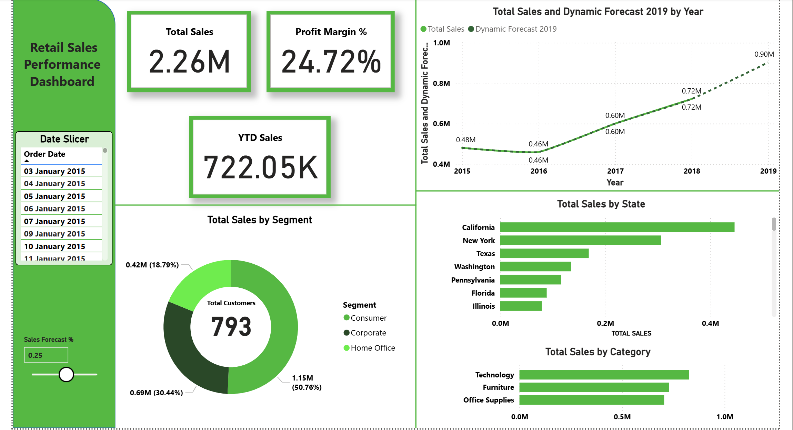

# Retail Sales Performance Dashboard

This project features a comprehensive analysis of a superstore's sales data. The goal was to build an end-to-end data analysis solution, from raw data processing to an interactive Power BI dashboard, to uncover actionable insights and inform business strategy.

## Dashboard Preview
*(You can replace this text with the screenshot you have)*
 
*Note: A placeholder image `dashboard_preview.png` is referenced. Please add your screenshot with this name to the root project folder.*

---

## Project Goal

The primary objective was to create a dynamic and insightful dashboard to help business stakeholders understand sales performance. This involved answering key questions such as:
- What are the overall sales trends over time?
- Which product categories and sub-categories are the top performers?
- Which geographic locations are most profitable?
- What is the relationship between sales and profit?
- How can we forecast future sales based on adjustable growth targets?

---

## Workflow & Methodology

The project followed a structured data analysis workflow:

1.  **Data Cleaning and Preparation (Python)**:
    *   The initial dataset was loaded into a Jupyter Notebook using the `pandas` library.
    *   Data quality checks were performed to identify and handle missing values (e.g., `Postal Code`).
    *   Data types were corrected, especially for date fields (`Order Date`, `Ship Date`) to handle mixed formats.
    *   The cleaned dataset was exported to a new CSV file, ready for analysis in Power BI.

2.  **Data Modeling and Analysis (Power BI & DAX)**:
    *   The cleaned data was imported into Power BI.
    *   A `Profit` column was simulated using a DAX calculated column, as it was not present in the original dataset.
    *   Several key DAX measures were created to drive the analysis, including:
        *   `Total Sales`: The sum of all sales.
        *   `Profit Margin %`: To measure profitability.
        *   `YTD Sales`: For year-to-date performance tracking.
        *   `Total Customers`: A distinct count of customers.
    *   A **"What-if" Parameter** was implemented to allow for dynamic sales forecasting, enabling users to see the potential impact of different growth percentages.

3.  **Dashboard Development (Power BI)**:
    *   A multi-page, interactive dashboard was designed to present the findings in an intuitive way.
    *   Visuals included KPI cards, time-series line charts, bar charts for categorical analysis, and a KPI donut chart.
    *   Slicers and filters were added to allow for deep-dive analysis by region, product category, and date.

---

## Key Insights & Recommendations

The analysis revealed several key insights that can guide business decisions:

*   **Insight 1: Technology is the Driving Force**
    *   The **Technology** category is the highest contributor to total sales, with **Phones** and **Chairs** being the most lucrative sub-categories.
    *   **Recommendation**: Double down on marketing and inventory for these high-performing product lines. Explore cross-selling opportunities (e.g., phone accessories, desk chairs).

*   **Insight 2: Consistent Year-Over-Year Growth**
    *   The time-series analysis shows a clear and consistent upward trend in monthly sales, indicating healthy business growth.
    *   **Recommendation**: Use the **"What-if" forecast slicer** to set ambitious but achievable sales targets for the upcoming year and align inventory management accordingly.

*   **Insight 3: Geographic Concentration of Sales**
    *   Sales are heavily concentrated in specific regions and cities (e.g., California, New York City).
    *   **Recommendation**: Investigate underperforming regions to understand market challenges. Consider targeted marketing campaigns or logistical improvements to boost sales in these areas.

---

## Technical Stack

*   **Data Cleaning & EDA**: Python (Jupyter Notebook, Pandas, Matplotlib)
*   **Data Visualization & Dashboarding**: Microsoft Power BI
*   **Data Analysis Language**: DAX (Data Analysis Expressions)

---

## How to Use This Project

1.  **Explore the Dashboard**: Interact with the slicers for `Region`, `Category`, and `Year` to filter the data.
2.  **Use the Forecast Slicer**: Adjust the **Sales Forecast %** slicer (from -10% to +20%) to see how different growth scenarios impact the projected sales on the main line chart.
3.  **Review the Code**: The `notebooks/eda.ipynb` file contains all the Python code used for the data cleaning and initial exploration phase.
